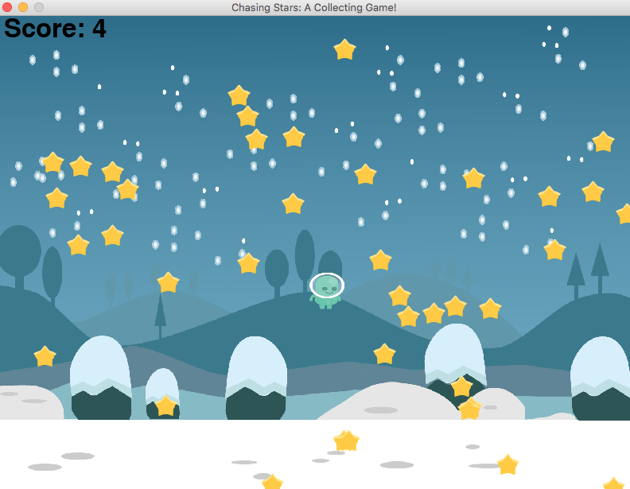

# chasing-stars
**A game featuring a character that grows while collecting stars!**



This is my first game built with the Pygame library. It works with Python 2.7 and 3. Yay!

Let's get started!

## Installations

* To get this game to run on your computer, you must first have **Python** installed. If you don't have Python already, you can install it from [Python.org](https://www.python.org/).
* Next, install the **Pygame** library. To do this, type `pip install pygame` into the command line. If this doesn't work, please check out the "Getting Started" section from [PyGame.org](https://www.pygame.org/wiki/GettingStarted), which includes a few variations for installing Pygame.

## Getting Started

Now that we have everything we need installed, let's really get started! 

* STEP 1 | In the command line, navigate to the directory where you would like to copy the repository. For example, your desktop.
  ```
  cd ~/desktop
  ```
* STEP 2 | Let's clone the `chasing-stars` game repository and then navigate into it. To do so, copy the following commands into the command line, entering one after the other:

  ```
  git clone https://github.com/running-on-sunshine/chasing-stars.git
  cd chasing-stars/
  ```
* STEP 3 | Once you're in the `chasing-stars` directory, we're going to run the game with the following command:

  ```
  python chasingStars.py
  ```
* If everything runs smoothly, you'll see an 800 x 600 screen pop up with the game. Have fun! I hope it gives you even the slightest bit of joy playing it as I did making it! :)

## Having Trouble?

* If you have trouble with any of the steps above, please feel free to send me an email. I'd love to help! Email me at khuu.liz [at] gmail.com.

## To Do:

The work is still not finished yet.

- Refactor code as classes
- Maybe add items dropping from the sky. If they touch our hero/ine character, the character will decrease in size/points?
